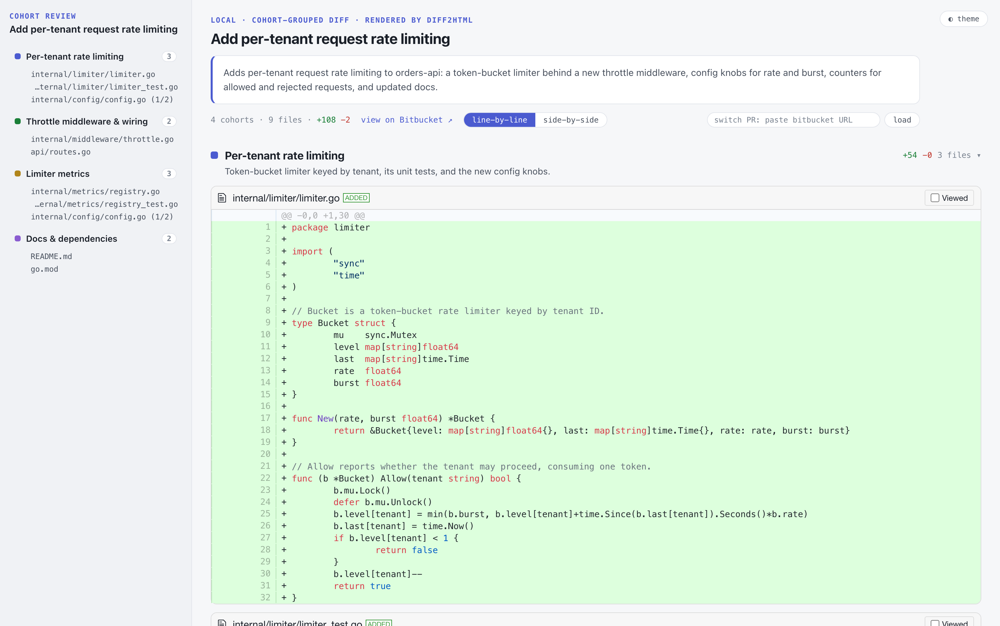

# cohort-review

Local, read-only PR review aid: fetches a Bitbucket PR's diff, groups changed files into named cohorts with one LLM call, and serves an interactive [diff2html](https://diff2html.xyz) page on localhost. Never posts anything back to the PR.



*A fictional demo PR grouped into four cohorts — tests sit with the code they test, and `config.go`'s two hunks are split across the two cohorts they belong to (the `(1/2)` badges).*

## Setup

Requirements: Go 1.24+, the `claude` CLI in PATH (logged in, or `CLAUDE_CODE_OAUTH_TOKEN` set).

Credentials — in the environment or a `./.env` file, either pair (tried in this order):

```
BITBUCKET_USERNAME=<username>   BITBUCKET_APP_PASSWORD=<app password>
BITBUCKET_EMAIL=<email>         BITBUCKET_API_TOKEN=<Atlassian API token>
```

Install: `go install github.com/s3rli/cohort-review@latest` — or clone and `go build .`

## Usage

```
cohort-review https://bitbucket.org/{workspace}/{repo}/pull-requests/{id}
```

Fetches the diff, groups it into cohorts (~10–60s), prints a `http://127.0.0.1:<port>` URL, and opens your browser. Ctrl-C to quit.

| Flag | Default | |
|---|---|---|
| `--port` | `0` (auto) | listen port |
| `--no-open` | | don't open the browser |
| `--model` | `sonnet` | claude model for grouping |
| `--budget` | `204800` | max chars of diff hunks sent to the model |
| `--format` | `line-by-line` | initial layout, or `side-by-side` |
| `--metrics` | `~/.cohort-review/runs.jsonl` | append a JSON record per load attempt (misc_lines_pct, folded_lines_pct, anchor stats, cohort types) to `<path>`; empty disables |

In the page: sidebar navigates cohorts, cohort headers collapse, toggle line-by-line ↔ side-by-side, `◐ theme` switches dark/light. Paste another PR URL in the header's "switch PR" box to load it in place (re-groups, ~10–60s).

## Cohort types

Cohorts carry a type: **claim** (answer the one-question claim), **mechanical** / **deletion** (repeated same-shape churn — lockfiles, generated files, formatting, often folded out of the model input — or deleted files; start collapsed: verify the representative, or answer the three deletion questions), **nonfix** (review the decision not to fix), **misc** (undeclared by the description — floats first; ask the author). Untyped cohorts are grouping fallbacks.

## Notes

- Grouping never blocks the page: if the LLM call fails or returns garbage (retried once), everything renders under a single "All changes" cohort.
- A mixed-concern file can be split across cohorts by hunk — the sidebar shows a `(k/M)` hunk count and the full diff still renders exactly once.
- Diffs over the budget still group **all** files — overflow files' hunks are trimmed to their leading hunks (or omitted entirely) in the model input; the rendered page always shows the full diff.
- Server binds 127.0.0.1 only.
- Repeated churn is folded out of the model input — piles of deleted files, and ≥5 same-directory/same-extension/same-size files reduced to one representative — so the model sees a summary line instead of their hunks. The rendered page always shows the full diff.
- Small pieces are copied from the internal `code-review-agent` repo (marked with provenance headers) pending same-source convergence.
- `make golden` replays the three stored golden PRs for human comparison (see `testdata/golden/`).
